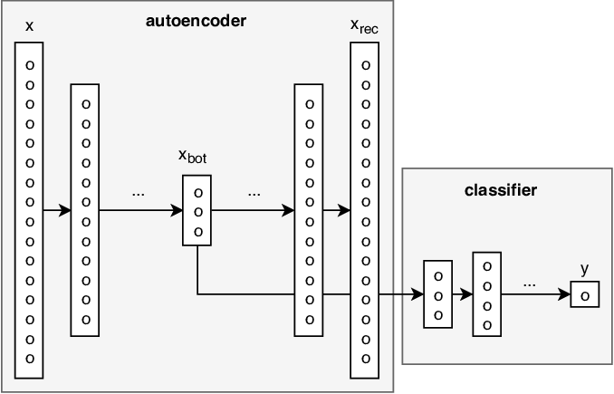

# Rare Event Prediction

## Description

This project investigates the performance of an auto-encoder in the task of extreme rare case prediction, with a case study focused on bank account fraud data. The dataset used for this purpose is the Bank Account Fraud Dataset (BAF), published at NeurIPS 2022. In this dataset, the positive class (class 1) is rare, comprising only 1.4% of the total examples, while the negative class (class 0) makes up the remaining 99%.

## Dataset

The project utilizes the Bank Account Fraud Dataset (BAF) published at NeurIPS 2022. This dataset consists of six different synthetic bank account fraud tabular datasets. The dataset can be found [here](https://www.kaggle.com/datasets/sgpjesus/bank-account-fraud-dataset-neurips-2022?select=Base.csv).

Reference:
S. Jesus, J. Pombal, D. Alves, A. Cruz, P. Saleiro, R. P. Ribeiro, J. Gama, P. Bizarro. "Turning the Tables: Biased, Imbalanced, Dynamic Tabular Datasets for ML Evaluation." Advances in Neural Information Processing Systems, 2022.

## Pre-processing

The data undergoes several pre-processing steps to prepare it for modeling. Empty columns are removed, missing values are imputed using KNN imputer, and numerical values are scaled using min-max scaler. Non-numeric values are transformed using one-hot encoding.

## Model Architecture

*Image Source: https://www.researchgate.net/figure/Architecture-for-supervised-anomaly-detection-using-a-jointly-trained-supervised_fig6_326681389*

The model architecture combines an autoencoder with a classification layer. The autoencoder aims to reconstruct input data through an encoded representation, while the classifier utilizes the encoded representation for classification tasks. The architecture includes an encoder, a decoder, and a binary classifier:

- Encoder: Reduces input dimensionality using a linear layer followed by a ReLU activation.
- Decoder: Attempts to reconstruct the original input data from the encoded representation using a linear layer.
- Classifier: Predicts binary classification output (0 or 1) using a linear layer followed by dropout to prevent overfitting and a sigmoid activation to squash output between 0 and 1.

The training loop combines reconstruction loss and classification loss for optimization.

*Training Loss*

*Validation Loss*

## Results

The project explored other cost-sensitive learning options, such as SVC with weighted classes and One-Class SVM, which yielded poor F1-scores around 0.32. However, the main focus is on the autoencoder's performance. An F1-score of 0.1 indicates suboptimal performance. The model struggles to identify positive class instances while maintaining a low rate of false positives. The model is biased towards the majority class, resulting in limited sensitivity to the positive class.

Next steps include experimenting with Random Forest, XGBoost, or LightGBM.

## Dependencies and Environment

- Python 3.8 or higher
- Virtual environment
- torch==2.0.1
- scikit-learn==1.3.0
- pandas==1.5.3
