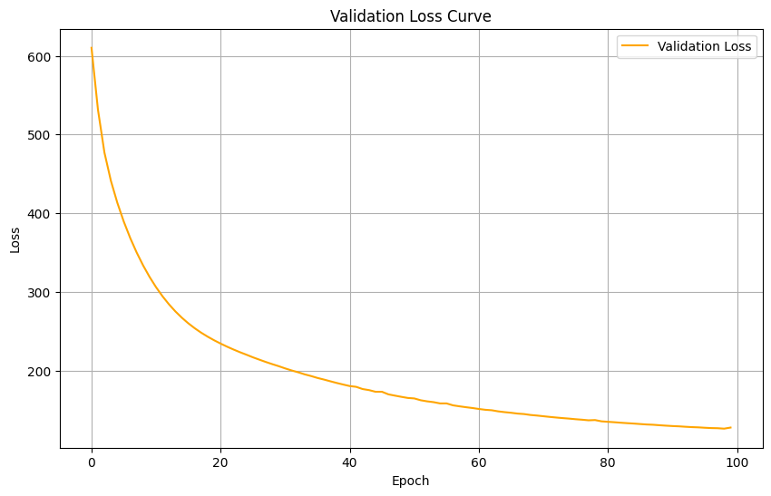
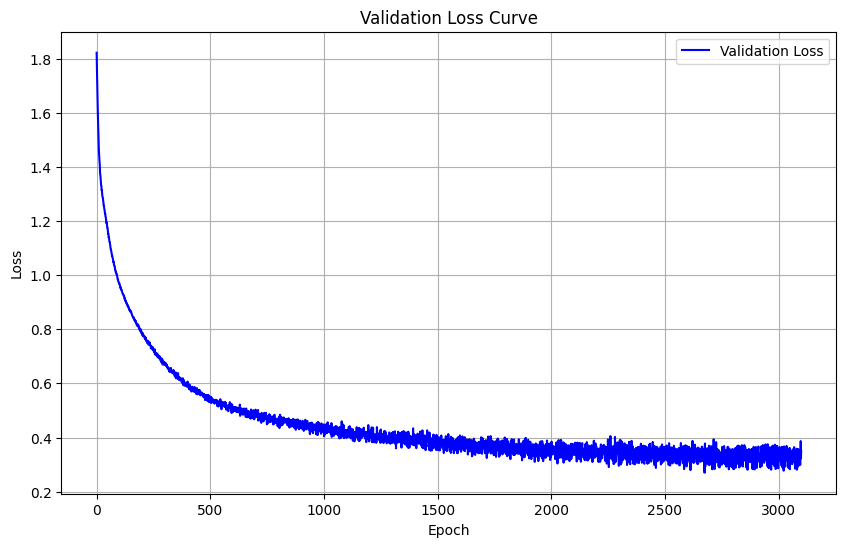

# Rare_Event_Prediction
Creating a comprehensive README for a machine learning project is essential for helping others understand and use your work effectively. Here's a structured guide to writing a README for a machine learning project:

1. **Auto-Encoder to Classification**
   - Investgave the preformance of auto-encoder in the task of  extreme rare case, the case study is bank account fraud data. In this dataset the positive class (class 1) is rare, comprising only 1% of the total examples, while the negative class (class 0) makes up the remaining 99%. 

2. **Dataset:**
   - I have use BAF that has been published at NeurIPS 2022 and it comprises a total of 6 different synthetic bank account fraud tabular datasets found here https://www.kaggle.com/datasets/sgpjesus/bank-account-fraud-dataset-neurips-2022?select=Base.csv.

   [1] S. Jesus, J. Pombal, D. Alves, A. Cruz, P. Saleiro, R. P. Ribeiro, J. Gama, P. Bizarro. "Turning the Tables: Biased, Imbalanced, Dynamic Tabular Datasets for ML Evaluation." Advances in Neural Information Processing Systems, 2022.
  

3. **Pre-processing**
   - For preprocessing the data has been cleaned from empty columns, nan values has been imputed using knn imputer, it has been scaled using min-max scaler to scale it between [0,1], non numaric values has been embedded using one-hot-encoding.

6. **Model Architecture:**
   
   credit https://www.researchgate.net/figure/Architecture-for-supervised-anomaly-detection-using-a-jointly-trained-supervised_fig6_326681389
   - Architecture combines an autoencoder with a classification layer. The autoencoder aims to reconstruct the input data through an encoded representation, and the classifier utilizes the encoded representation for classification tasks.
   - In the hope that Autoencoders  learn to reconstruct normal data patterns, and deviations from this reconstruction could indicate anomalies. By combining the reconstruction loss with a classification loss, you can identify anomalies while also classifying them into different categories.
   - It consists of three main parts: an encoder, a decoder, and a binary classifier.
        - The encoder takes the input data and reduces its dimensionality to n_embedded using a linear layer followed by a ReLU activation.
        - The decoder takes the encoded data and attempts to reconstruct the original input data using a linear layer.
        - The classifier takes the encoded data and predicts a binary classification output (0 or 1) using a linear layer followed by a dropout layer to prevent overfitting, and a sigmoid activation to squash the output between 0 and 1.
    - In the traning loop later I combine the two losses and for the backward pass to calculate gradients.
    
       
      Training loss

    
   
7. **Results**
   - Firstly I explored other cost-sensitive learning options SVC with weighted class. The preformance was poor of f1:0.32. I have also used One-Class SVM that got similar relsuts. Although I am mainly curious about the autoencoder preformance.
   - An F1-score of 0.1 is generally considered to be poor performance.

9. **Hyperparameters:**
   - List the hyperparameters used for training your model.
   - Explain the significance of each hyperparameter and how to tune them.

10. **Dependencies and Environment:**
    - Specify the required Python version and any specific library versions.
    - If you're using virtual environments, provide instructions for setting up the environment.
# Rare_Event_Prediction
# Rare_Event_Prediction
